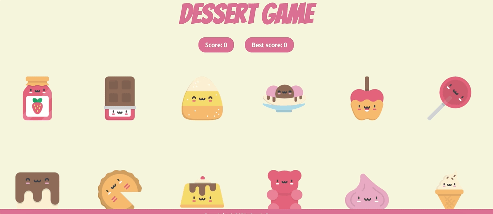

# React-memory-card

## A simple memory game created with React

## Language/libraries 
- React
- React states
- React hooks and components

## Challenges

- The main challenge of creating this game was figuring out how to make the cards shuffle on every click. Luckily, this was solved by using a very simple shuffling algorithm called the Fisher-Yates shuffle.
- Since this was my first React application, it was interesting to figure out how to store the cards that were clicked vs unclicked, keep track of scores and update the score/best score using React states.

## Live view
👉 https://qymmore.github.io/react-memory-card/

## Future direction
- Add an announcement feature declaring a win or a loss
- A button to allow users to be able to reset the scoreboard or restart the game
- Add levels of different difficulties that challenge users
